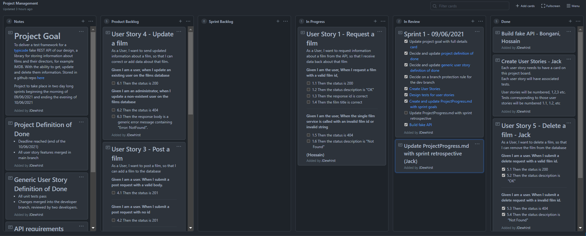
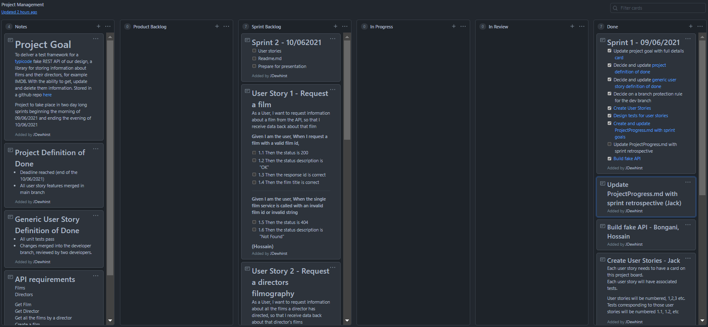
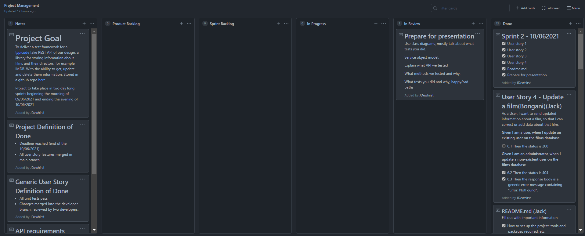

# Project Progress

## Project Goal

To deliver a test framework for a [typicode](https://my-json-server.typicode.com/) fake REST API of our design, a library for storing information about films and their directors, for example IMDB. With the ability to get, update and delete them information. Stored in a github repo [here](https://github.com/Bongiboy777/APITesting)

Project to take place in two day long sprints beginning the morning of  09/06/2021 and ending the evening of 10/06/2021

## Sprint 1 - 09/06/2021

**Sprint Goals**

- [x] Update project goal with full details
- [x] Decide on and update the project definition of done
- [x] Decide on and update the generic user story definition of done
- [x] Decide on a branch protection rule for the dev branch
- [x] Create user stories
- [x] Create and update ProjectProgress.md with Sprint 1 goals
- [x] Update Project.md with sprint retrospective
- [x] Build the fake API

**Pre-Sprint Project Board**

**Sprint Retrospective**

We accomplished everything that we set out to do on this sprint. However we did encounter some blockers while going on to do further things. We began to build the framework and encountered problems to do with the AppConfig, ConfigurationManager.AppSettings["baseUrl"] is returning a null for us. This isn't a huge problem since there isn't anything we need to hide persay, the baseUrl points at an open gitrep where our Typicode API is set-up. 

On top of the sprint goals we completed User Story 1, testing and merging it into the dev branch. 

In hindsight we perhaps created more work for ourselves by using typicode rather than a pre-existing API, however we still accomplished everything we wanted to do in this sprint and more..

**Post-Sprint Project Board**

## Sprint 2 - 10/06/2021

**Sprint Goals**

- [x] User Story 1
- [x] User Story 2
- [x] User Story 3
- [x] User Story 4
- [x] Prepare for presentation
- [x] Update README.md

**Pre-Sprint Project Board**

**Sprint Retrospective**

We accomplished everything we set out to on this sprint, save for two tests which are failing. Otherwise finishing the project, as well as adding some extra tests along the way. 

**Post Sprint Project Board**

